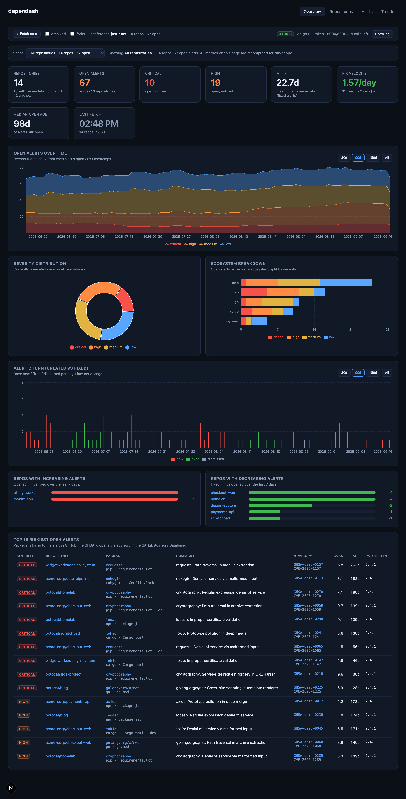
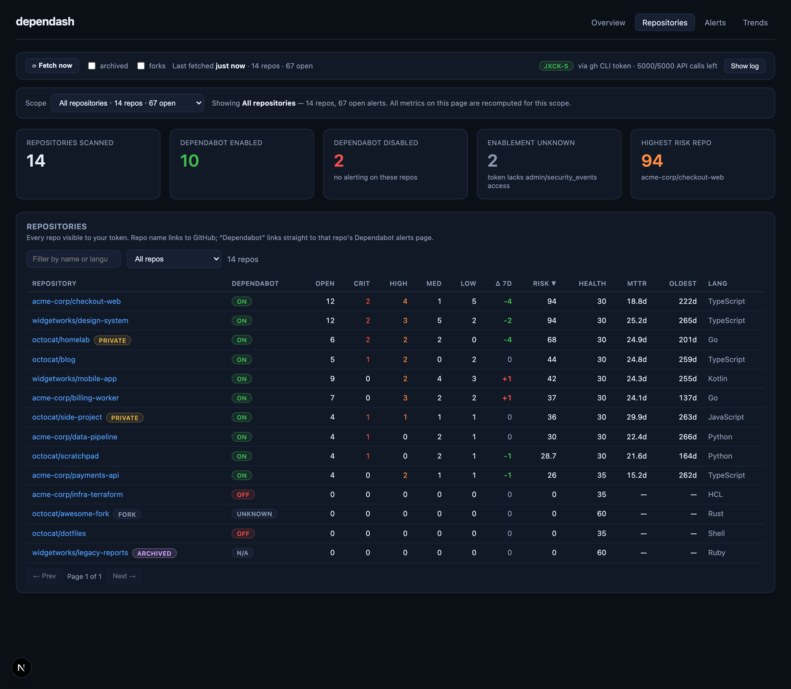
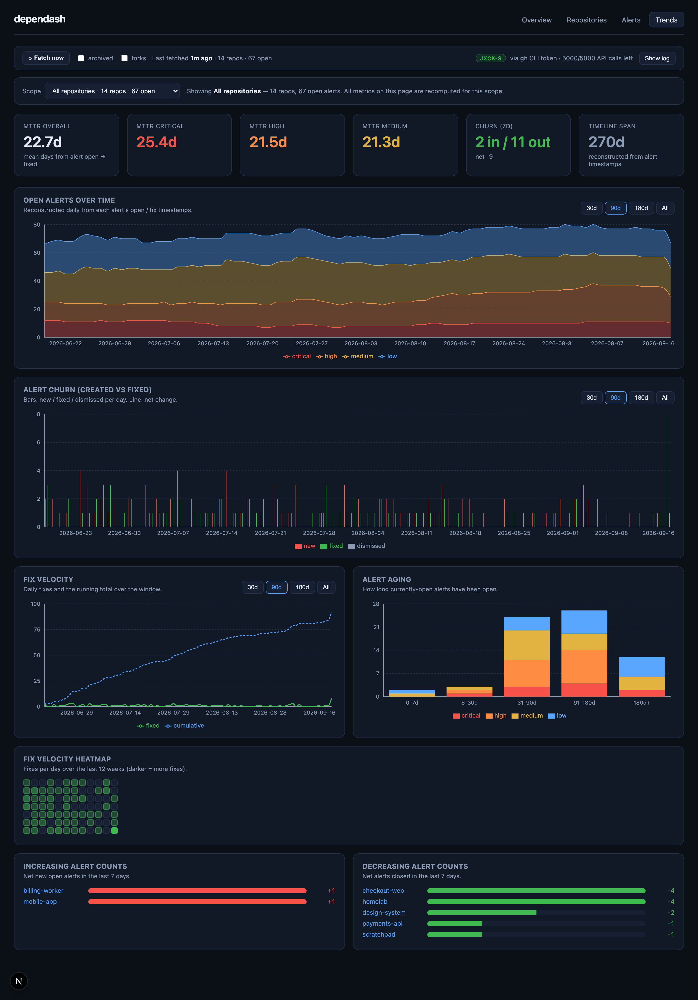

# dependash

**One dashboard for every Dependabot alert you can see — across personal repos, org repos, and
repos you collaborate on in other people's accounts.**

GitHub shows you Dependabot alerts one repository at a time. Security overview dashboards that
aggregate them exist, but they're scoped to an **organization** — so they can't help you if your
code is spread across your own account, a couple of orgs, and a few repos you contribute to
elsewhere.

dependash takes the other approach: it logs in **as you**, walks every repository your account can
reach, and puts the whole picture in one place. Nothing has to be moved into an org, and no
repository is modified in any way.



<sub>Screenshots use generated demo data — see [Try it without a token](#try-it-without-a-token).</sub>

## Why

| | |
| --- | --- |
| 🔭 **Cross-account by design** | Personal + org + collaborator repos in a single view. Your access token is the only boundary. |
| 🔒 **Read-only, provably** | Every GitHub call is an HTTP `GET`. No commits, PRs, workflows, Actions, or settings changes — there is no code path that can write. |
| 🏠 **Runs on your machine** | A local Next.js app on `localhost:3939`. Your alert data never leaves your computer. |
| 📈 **History from a single fetch** | Trends, MTTR and fix velocity are reconstructed from the timestamps GitHub already stamps on every alert — no database, no scheduled jobs, no waiting weeks to collect data points. |
| 🎯 **Triage-oriented** | Risk and health scores, alert aging, churn, ecosystem breakdown, and deep links straight to the alert or advisory on GitHub. |

## What you get

- **Which repos have Dependabot enabled** — and, just as usefully, which ones *don't*.
- **Every open alert**, sorted by severity, with advisory metadata (GHSA, CVE, CVSS, patched
  version) and a direct link to the alert on GitHub.
- **Trends over time** — open alerts by severity, alerts opened vs fixed, fix velocity, aging
  buckets.
- **Per-repo scoring** — risk score (severity-weighted, amplified by how long alerts have sat
  unfixed), health score, MTTR, oldest open alert.
- **An owner filter** — everything, just your personal repos, just orgs, or one specific owner.
  Filtering re-runs the whole aggregation, so every number reflects the scope.

## Requirements

- **Node.js 20+** and npm
- A GitHub account, plus either the [`gh` CLI](https://cli.github.com) or a personal access token
- macOS, Linux, or Windows (developed on macOS)

---

## 1. Quick start

```bash
git clone https://github.com/Jxck-S/dependash.git
cd dependash
npm install

# authenticate (either option works)
gh auth login                # recommended: dependash calls `gh auth token`
export GITHUB_TOKEN=ghp_xxx  # or a personal access token

npm run dev                  # → http://localhost:3939
```

Then click **⟳ Fetch now** in the dashboard header. That's it — no terminal step is required.

If you'd rather collect from the CLI:

```bash
npm run snapshot
```

Either way the result **replaces** the stored fetch; only the latest one is ever kept.

### Try it without a token

Want to see the UI before pointing it at your account?

```bash
npm run demo     # generates a synthetic fetch (14 fake repos, ~300 alerts)
npm run dev
```

This writes to the same store the real collector uses, so pressing **⟳ Fetch now** replaces it with
your actual data. No network calls, no token required.

### Repositories view

Every repo your token can see, with enablement status, severity breakdown, risk/health scores, and
**archived** / **private** / **fork** badges. Note the three different owners in one table — that's
the whole point.



### Trends



### Collecting from the UI

The header strip on every page shows:

- **⟳ Fetch now** — runs the read-only collector in-process, streaming progress
  (`scanned 80/127`) into an expandable log. When it finishes, the page refreshes itself and every
  metric updates in place. No terminal, no restart, no rebuild.
- **Last fetched `<n>`m ago · `<n>` repos · `<n>` open** — how fresh the loaded data is.
- **Auth badge** — the authenticated login, how the token was found (`gh CLI token` or the env var
  name), and remaining API quota.

Guardrails on the run endpoint:

| Guard | Behaviour |
| --- | --- |
| Loopback only | Requests whose `Host` isn't `localhost`/`127.0.0.1`/`::1` get `403`. Override with `DEPENDASH_ALLOW_REMOTE_RUN=1` if you self-host behind your own auth. |
| One at a time | A second concurrent run returns `409`. |
| No shell from the browser | The `--dependamate` external-command option is deliberately **not** exposed over HTTP; it's CLI-only. |
| Still read-only | It calls the same collector, so GitHub only ever sees `GET` requests. |

### How data refreshes

Two decoupled steps — nothing polls GitHub in the background:

1. **Collection** happens only when you trigger it (button or CLI). It overwrites the single
   last-fetch file.
2. **Rendering** re-reads that file on *every* request (`dynamic = 'force-dynamic'`, no caching),
   so a reload — or the automatic refresh after a UI run — always shows the latest fetch.

An idle browser tab does not update on its own; use the button (or reload) to pull in new data.

### Scripts

| Command | What it does |
| --- | --- |
| `npm run snapshot` | Read-only scan of GitHub → overwrites the single last-fetch file |
| `npm run demo` | Generate synthetic data to explore the UI without a token |
| `npm run dev` | Dashboard in dev mode on port 3939 |
| `npm run build && npm start` | Production build (for hosting on your own box) |
| `npm test` | Self-test of the metrics/trend engine (no network) |
| `npm run typecheck` | `tsc --noEmit` |

---

## 2. Authentication

**How it talks to GitHub:** the `gh` CLI is used *only* to borrow a token (`gh auth token`). All
API traffic is native `fetch()` to `https://api.github.com` with an `Authorization: Bearer` header —
`gh` is not used as the HTTP client. You can see this live at `/api/auth`.

The runner resolves a token in this order:

1. `$DEPENDASH_TOKEN`
2. `$GITHUB_TOKEN`
3. `$GH_TOKEN`
4. `gh auth token` (GitHub CLI keychain) ← easiest, nothing to store on disk

**Required scopes** for a classic PAT:

| Scope | Why |
| --- | --- |
| `repo` | list private repos and read their Dependabot alerts |
| `security_events` | read Dependabot alerts (fine-grained: *Dependabot alerts: read*) |
| `read:org` | enumerate org repositories |
| `admin:repo_hook` *(optional)* | lets `GET /repos/:o/:r/vulnerability-alerts` report enablement precisely |

Without admin rights on a repo, enablement is still inferred from the alerts endpoint:
`403 "Dependabot alerts are disabled"` → **off**, a successful listing → **on**, anything else → **unknown**.

The token is never written to disk by this project, and never sent anywhere except `api.github.com`.
The `/api/auth` endpoint reports *how* the token was found, but never the token itself.

### Which repositories show up

This is the part that makes dependash different from an org security dashboard. It calls
`GET /user/repos`, which returns every repo your token can reach, regardless of who owns it:

| Source | Included? |
| --- | --- |
| Repos you own (public and private) | ✅ |
| Repos in orgs you belong to | ✅ (needs `read:org`) |
| Repos in *other people's* accounts where you're a collaborator | ✅ |
| Forks | ⬜ excluded by default — `--include-forks` or the **forks** checkbox |
| Archived repos | ⬜ excluded by default — `--include-archived` or the **archived** checkbox |

Narrow it with `--affiliation owner` (just yours), `--affiliation organization_member` (just org
repos), or `--owner some-org`. Skip an org with `--exclude-org some-org` (or tick it in the **skip orgs**
dropdown next to *Fetch now*, which lists your orgs from GitHub plus any owner seen in the last fetch). In the UI, the scope selector does the same thing interactively.

> Alerts require read access to a repo's security data. For org repos, that usually means being an
> owner/admin or having been granted the *security manager* role — otherwise the repo appears with
> its Dependabot status listed as **unknown** rather than a count.

### Runner options

```bash
npm run snapshot -- --help

  --owner <a,b>          Only scan these orgs/users
  --exclude-owner <a,b>  Skip these orgs/users            (alias: --exclude-org)
  --repo <owner/name>    Only scan these repositories
  --include-archived     Include archived repositories
  --include-forks        Include forks
  --visibility <v>       all | public | private            (default: all)
  --affiliation <list>   owner,collaborator,organization_member
  --concurrency <n>      Parallel repo scans                (default: 6)
  --max-alert-pages <n>  Max 100-alert pages per repo       (default: 20)
  --dependamate "<cmd>"  Use an external scanner for alert data
  --quiet                Only print the final summary
```

### Using DependaMate (or any external scanner) instead of the API

```bash
npm run snapshot -- --dependamate "dependamate scan --json"
```

The command must print JSON to stdout (`{alerts:[…]}`, `{results:[…]}` or a bare array).
`src/lib/dependamate.ts` maps it permissively onto the internal `AlertRecord` shape; the repo
inventory and enablement flags still come from the read-only API.

---

## 3. Project structure

```
dependash/
├── scripts/
│   ├── snapshot.ts              ← local runner (read-only collector)
│   ├── demo.ts                  ← synthetic data generator (no network)
│   └── selftest.ts              ← metric engine assertions, no network
├── src/
│   ├── lib/
│   │   ├── types.ts             ← every TypeScript interface (data model)
│   │   ├── github.ts            ← read-only REST client (GET only)
│   │   ├── dependamate.ts       ← optional external-scanner adapter
│   │   ├── store.ts             ← the single last-fetch file: read / write / clear
│   │   ├── scope.ts             ← personal / org / single-owner scoping
│   │   ├── collect.ts           ← shared collector used by CLI *and* UI button
│   │   ├── runstate.ts          ← progress state for UI-triggered runs
│   │   ├── metrics.ts           ← lifecycles, trends, MTTR, risk, churn
│   │   └── data.ts              ← server-side entry point for the UI
│   ├── app/
│   │   ├── api/snapshot/route.ts ← POST = run collector, GET = progress (local only)
│   │   ├── api/auth/route.ts     ← reports auth method (never returns the token)
│   │   ├── layout.tsx           ← shell + nav + run controls
│   │   ├── icon.svg             ← app icon / favicon (source of truth)
│   │   ├── favicon.ico          ← 16/32/48/64 multi-size fallback
│   │   ├── apple-icon.png       ← 180×180 apple-touch-icon
│   │   ├── manifest.ts          ← web manifest (installable app icon)
│   │   ├── page.tsx             ← Overview
│   │   ├── repos/page.tsx       ← Repositories
│   │   ├── alerts/page.tsx      ← Alerts
│   │   ├── trends/page.tsx      ← Trends
│   │   └── globals.css
│   └── components/
│       ├── Charts.tsx           ← all recharts components (client)
│       ├── RepoTable.tsx        ← sortable/filterable repo table (client)
│       ├── AlertTable.tsx       ← searchable alert table (client)
│       ├── TrendList.tsx        ← increasing/decreasing repo bars
│       ├── ScopeSelector.tsx    ← personal / orgs / owner dropdown (client)
│       ├── ScopeBar.tsx         ← selector + active-scope summary
│       ├── RunControls.tsx      ← run button, progress log, auth badge
│       ├── NavTabs.tsx, Ui.tsx, EmptyState.tsx
├── public/
│   ├── icon-192.png             ← manifest icon
│   └── icon-512.png             ← manifest icon (also maskable)
└── package.json
```

### App icon

The icon is a blue security shield holding three severity bars (medium / high / critical) — the app's subject in one glyph. `src/app/icon.svg` is the source of truth; everything else is rendered from it with `sharp`:

```bash
# regenerate rasters after editing src/app/icon.svg
node -e "
const sharp=require('sharp'),fs=require('fs');
const svg=fs.readFileSync('src/app/icon.svg');
(async()=>{
  await sharp(svg).resize(180,180).flatten({background:'#0b0f16'}).png().toFile('src/app/apple-icon.png');
  for(const s of [192,512]) await sharp(svg).resize(s,s).png().toFile('public/icon-'+s+'.png');
})();"
```

The design is deliberately low-detail so the silhouette still reads at 16×16 in a browser tab. Next.js auto-emits the `<link rel="icon">`, `apple-touch-icon` and `manifest` tags — there is no manual `<head>` markup.

---

## 4. Data model

### The last-fetch file

Stored at `$TMPDIR/dependash/last-fetch.json` (override with `DEPENDASH_STATE_DIR`). Written
atomically, and replaced in full by every run:

```jsonc
{
  "schemaVersion": 1,
  "meta": {
    "date": "2026-09-16",            // local date of the fetch
    "takenAt": "2026-09-16T17:02:11.480Z",
    "viewer": "your-login",
    "source": "github-api",          // or "dependamate"
    "toolVersion": "dependash@1.0.0",
    "reposScanned": 127,
    "reposWithAlertsEnabled": 36,
    "reposSkipped": 0,
    "durationMs": 41230,
    "errors": []
  },
  "repos": [
    {
      "fullName": "owner/repo",
      "owner": "owner", "ownerType": "Organization",   // User | Organization | null
      "private": false, "archived": false, "fork": false,
      "language": "TypeScript", "stars": 12, "pushedAt": "2026-09-01T…",
      "htmlUrl": "https://github.com/owner/repo",
      "dependabotUrl": "https://github.com/owner/repo/security/dependabot",
      "dependabotAlertsEnabled": true,          // true | false | null (unknown)
      "dependabotSecurityUpdatesEnabled": null,
      "enablementSource": "alerts-api-ok",
      "error": null,
      "openAlerts": 4,
      "openBySeverity": { "critical": 1, "high": 2, "medium": 1, "low": 0 },
      "fixedAlerts": 31,
      "dismissedAlerts": 0
    }
  ],
  "alerts": [
    {
      "key": "owner/repo#12",                   // stable identifier
      "repo": "owner/repo", "number": 12,
      "state": "open",                          // open|fixed|dismissed|auto_dismissed
      "severity": "high",
      "ghsaId": "GHSA-xxxx-xxxx-xxxx", "cveId": "CVE-2025-1234",
      "summary": "…", "cvssScore": 7.5,
      "ecosystem": "npm", "packageName": "lodash",
      "manifestPath": "package.json", "scope": "runtime",
      "vulnerableVersionRange": "< 4.17.21", "firstPatchedVersion": "4.17.21",
      "createdAt": "…", "updatedAt": "…", "fixedAt": null,
      "dismissedAt": null, "dismissedReason": null,
      "htmlUrl": "https://github.com/owner/repo/security/dependabot/12",
      "advisoryUrl": "https://github.com/advisories/GHSA-xxxx-xxxx-xxxx"
    }
  ]
}
```

The fetch keeps **every** alert state (open, fixed, dismissed), not just the open ones — that's what
makes MTTR, fix velocity and the trend charts computable from a single run. Derived metrics
(`DashboardData`, `DailyPoint`, `LifecycleRecord`, `RepoMetric`, `EcosystemBreakdown`, `AgingBucket`,
`FixVelocityCell`) are **never** stored; they are recomputed on every page load, so you can delete
the file at any time and just fetch again.

---

## 5. How historical metrics are computed

GitHub exposes no history endpoint for Dependabot state — but it doesn't need to, because every
alert it returns is already stamped with its own history.

### Trends come from alert timestamps, not from stored copies

Every alert carries `created_at` and, once closed, `fixed_at` / `dismissed_at`. Replaying those
timestamps forward gives an accurate day-by-day curve from a **single** fetch:

```
openAlerts(day) = | { alert : openedAt ≤ day  AND  (closedAt is null OR closedAt > day) } |
```

This is why the app doesn't keep an archive: a fetch taken today already contains the information
needed to draw the last two years. Fetching again simply moves the whole picture forward.

The one blind spot is an alert that disappears entirely (repo deleted, Dependabot switched off) —
GitHub stops returning it, so it leaves the timeline at the point it vanished rather than being
recorded as fixed.

### Lifecycle record

For each alert (`owner/repo#number`) in the fetch:

| Field | Rule |
| --- | --- |
| `openedAt` | GitHub's `created_at` |
| `closedAt` | `fixed_at` / `dismissed_at`, else `null` while still open |
| `closedState` | `fixed` \| `dismissed` \| `auto_dismissed` \| `null` |
| `ageDays` | `closedAt − openedAt`, or `today − openedAt` while still open |

### Metric definitions

| Metric | Definition |
| --- | --- |
| **Alerts per day** | New lifecycles whose `openedAt` equals that day |
| **Fixes per day** | Lifecycles whose `closedAt` equals that day with `closedState = fixed` |
| **Severity trend** | Open lifecycles per day, bucketed by severity (stacked area) |
| **Alert churn** | `newAlerts` vs `fixedAlerts + dismissedAlerts`; `netChange = new − fixed − dismissed` |
| **MTTR** | Mean of `closedAt − openedAt` (days) over all `fixed` lifecycles — overall and per severity |
| **Fix velocity** | Fixes in the trailing 7 days ÷ 7, plus a cumulative-fix line and a 12-week heatmap |
| **Median open age** | Median `ageDays` of alerts still open |
| **Alert aging** | Open alerts bucketed into 0-7d / 8-30d / 31-90d / 91-180d / 180d+ |
| **Repo risk score** | `(10·critical + 5·high + 2·medium + 1·low) × (1 + min(1, oldestOpenDays / 180))` — an unfixed critical from six months ago scores double the same alert opened today |
| **Repo health score** | `100 − min(70, risk × 2.5)`; forced to `35` if Dependabot is **off**, `60` if enablement is unknown (you can't fix what you can't see) |
| **Increasing / decreasing** | Per repo, `alerts opened − alerts closed` within the trailing 7 days, computed from lifecycle timestamps (no second fetch required) |
| **Ecosystem breakdown** | Open alerts grouped by package ecosystem, split by severity, with distinct repo counts |

Reconstructed history is capped at 730 days to keep the series bounded.

---

## 6. Dashboard pages

| Page | Contents |
| --- | --- |
| **Overview** `/` | 8 KPI cards (repos, open alerts, critical/high, MTTR, fix velocity, median age, last fetch), stacked severity-over-time area chart, severity donut, ecosystem bar chart, churn chart, increasing/decreasing repo lists, top-15 riskiest alerts || **Repositories** `/repos` | Enablement KPI cards + full sortable/filterable/paginated repo table: Dependabot on/off/unknown, open counts by severity, 7-day Δ, risk score, health score, per-repo MTTR, oldest open alert, language. Repo names carry **archived** / **private** / **fork** badges, and the filter dropdown includes *Active (not archived)* and *Archived only*. |

#### Archived repositories

Archived repos are **excluded from collection by default** — tick **archived** in the run bar (or pass
`--include-archived`) to bring them in. GitHub refuses Dependabot alert reads on archived repos, so
they are recorded with `enablementSource: 'archived'` and shown with an **n/a** Dependabot badge
rather than being counted as a collection warning.
| **Alerts** `/alerts` | Severity KPI cards, aging chart, and a searchable table of every open alert (search by repo, package, GHSA, CVE, summary; filter by severity and ecosystem) |
| **Trends** `/trends` | MTTR by severity, 7-day churn, severity-over-time, churn, fix velocity, aging, 12-week fix heatmap, increasing/decreasing lists |

### Owner scope selector (personal vs organizations)

Every page has a **Scope** dropdown at the top:

| Option | Shows |
| --- | --- |
| All repositories | everything in the snapshot |
| `<you>` (personal) | repos owned by your own account |
| All organizations | repos owned by any org you belong to |
| *Organizations* group | one specific org |
| *Other users* group | repos you collaborate on that belong to someone else |

Each option shows its repo and open-alert counts inline, so you can see the split without switching.

The choice is **not** a table filter — it is applied to the raw fetch *before* aggregation, so
KPI cards, severity trends, churn, fix velocity, aging, risk scores and MTTR are all recomputed for
the selected slice. (Example: overall MTTR of 45.7d can be 59.8d for personal repos and 26.9d for org
repos.)

The scope lives in the URL as `?scope=personal`, `?scope=orgs`, or `?scope=owner:my-org`, so it
survives refreshes, is preserved when you switch tabs, and can be bookmarked. Unknown owners fall
back to "All repositories". A bare `?scope=my-org` is accepted as shorthand for `?scope=owner:my-org`.

Owner type comes from `ownerType` on each repo record. Snapshots taken before this field existed
still work — they fall back to "anything not owned by the authenticated user is an organization".

To limit collection itself (rather than just the view), use the runner's `--owner` flag:

```bash
npm run snapshot -- --owner my-org
```

### GitHub linking

- Repo name → `https://github.com/<owner>/<repo>`
- Dependabot badge on each repo row → `https://github.com/<owner>/<repo>/security/dependabot`
- Package name on each alert → that alert on GitHub (`…/security/dependabot/<number>`)
- GHSA id → `https://github.com/advisories/GHSA-…`

All links open in a new tab. They are plain links — the dashboard performs no GitHub writes of any kind.

---

## 7. Refreshing, without automation

There is deliberately **no** scheduler, workflow, launchd plist, or cron file in this project.
You refresh when you want to, with the **⟳ Fetch now** button or `npm run snapshot`.

Because trends are rebuilt from alert timestamps, you don't need a regular cadence and there are no
"gaps" to worry about — a single fetch taken right now already reconstructs the full timeline. Each
run replaces the previous one.

Nothing is written inside the project directory, so there is no data to git-ignore and nothing that
can accidentally be committed. The stored fetch lives in the OS temp directory and macOS will clean
it up on its own; if it's gone, just fetch again.

---

## 8. Hosting it (optional)

dependash is built **local-first**, but it's a standard Next.js app, so hosting it is mostly a
matter of deciding who is allowed to reach it.

```bash
npm run build
npm start          # serves on :3939
```

### What you must change before exposing it

The defaults assume "one trusted user on localhost". Three of them need attention:

| Default | Why it matters when hosted | What to do |
| --- | --- | --- |
| **No login** | The dashboard has no user model or session — anyone who reaches the port sees your alerts. | Put it behind a reverse proxy with your own auth (OAuth proxy, Tailscale, Cloudflare Access, basic auth). |
| **Loopback-only run endpoint** | `POST /api/snapshot` rejects non-loopback `Host` headers with `403`, so the Fetch button won't work through a proxy. | Set `DEPENDASH_ALLOW_REMOTE_RUN=1` — **only** once auth is actually in front of it. |
| **Temp-dir storage** | `$TMPDIR` gets cleaned by the OS and isn't shared between containers. | Set `DEPENDASH_STATE_DIR=/var/lib/dependash` to a persistent volume. |

### One token, one view

The app authenticates with a single token from the environment — it does **not** log visitors in
individually. Whoever can open the page sees whatever that one token can see. That's ideal for a
personal instance, and the reason to keep it private otherwise.

```bash
DEPENDASH_TOKEN=ghp_xxx \
DEPENDASH_STATE_DIR=/var/lib/dependash \
DEPENDASH_ALLOW_REMOTE_RUN=1 \
npm start
```

For a per-user experience you'd add a GitHub OAuth flow and key the stored fetch by user — a real
feature, not a config change, and the natural next step if you want to fork this into a team tool.

### Refreshing on a server

There's no built-in scheduler (by design). Click **⟳ Fetch now**, or if you want it hands-off on a
box you control, point *your own* cron at it — the project still ships no workflows or automation:

```cron
0 * * * * cd /srv/dependash && npm run snapshot --silent
```

### Environment variables

| Variable | Purpose |
| --- | --- |
| `DEPENDASH_TOKEN` | Token to authenticate with (also accepts `GITHUB_TOKEN` / `GH_TOKEN`) |
| `DEPENDASH_STATE_DIR` | Where the single last-fetch file is stored (default: `$TMPDIR/dependash`) |
| `DEPENDASH_ALLOW_REMOTE_RUN` | Set to `1` to allow non-loopback requests to trigger a fetch |

---

## 9. Guarantees

- `src/lib/github.ts` issues `method: 'GET'` exclusively — there is no code path that can POST, PATCH, PUT or DELETE.
- The only file writes are the single last-fetch JSON in `$TMPDIR` (or `DEPENDASH_STATE_DIR`) and the standard `.next/` build output. Nothing is written into your repositories.
- No GitHub Actions, workflows, commits, PRs, branches, releases, labels, or settings changes.
- No external database, telemetry, or third-party service. Only `api.github.com` is contacted.

---

## 10. Contributing

Issues and PRs are welcome. Before opening a PR:

```bash
npm run typecheck   # tsc --noEmit
npm test            # metric engine self-tests, no network
npm run build       # production build must stay clean
```

The read-only guarantee is the one hard rule: if a change introduces any HTTP method other than
`GET` against the GitHub API, it won't be merged.

## License

[MIT](LICENSE) © Jack Sweeney
